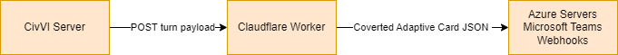

<!-- prettier-ignore-start -->
<p align="center">
  
  
</p>
<!-- prettier-ignore-end -->

# Civ VI → Teams Webhook Relay 🚀

A **serverless Cloudflare Worker** that transforms Civilization VI
(<abbr title="Play By Cloud">PbC</abbr>) webhook payloads into
Microsoft Teams **Adaptive Card**.



## Civ VI HTTP request payload

#### Civ server sends a POST request with a JSON object

| Payload key | Meaning                               | Type    |
|-------------|---------------------------------------|---------|
| `value1`    | Game name (one you create in a lobby) | String  |
| `value2`    | Player name                           | String  |
| `value3`    | Turn number                           | String  |

---


### 🤖 Civ VI Webhook JSON Format example
```jsonc
{
  "value1": "John Smith's Game",
  "value2": "John Smith",
  "value3": "2"
}
```

## ✨ Features

* **0-cold-start** Cloudflare Workers – instant response for every turn
* **Markdown-friendly** Adaptive Card template (easy to tweak)
* Tiny codebase – no framework bloat
* Free-tier-friendly (≈ 100 k requests/day on Workers, more than enough for Civ VI webhooks)

---

## 🏃‍♂️ Quick Start (Local)

```bash
# 1. clone & install wrangler
git clone https://github.com/arturaspaulius/civ6_webhook_for_teams.git
cd civ6_webhook_for_teams
npm i -g wrangler

# 2. add your Teams webhook URL
echo "TEAMS_WEBHOOK_URL=https://outlook.office.com/webhook/..." > .dev.vars

# 3. launch a local dev server (port 8787)
wrangler dev
```
## Send a sample turn:
```bash
curl -X POST http://localhost:8787 \
  -H "Content-Type: application/json" \
  -d '{"value1":"Office Cup","value2":"John Smith","value3":"42"}'
```

## 🚀 Deploy to Cloudflare Workers

```bash
# one-time login
wrangler login

# create a new worker
wrangler init --no-git --no-wrangler-config .

# fill in wrangler.jsonc
wrangler deploy
```

## 🔧 Change enviromental variable

| Variable	      | Description                             |
|-----------------|-----------------------------------------|
|TEAMS_WEBHOOK_URL|	Teams “Incoming Webhook” connector URL. |

---

## 📜 License
Apache License v2.0  – see LICENSE.

---